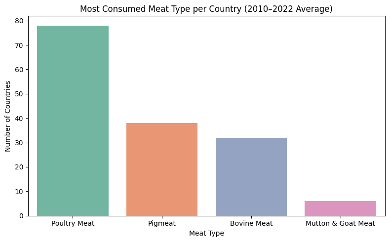
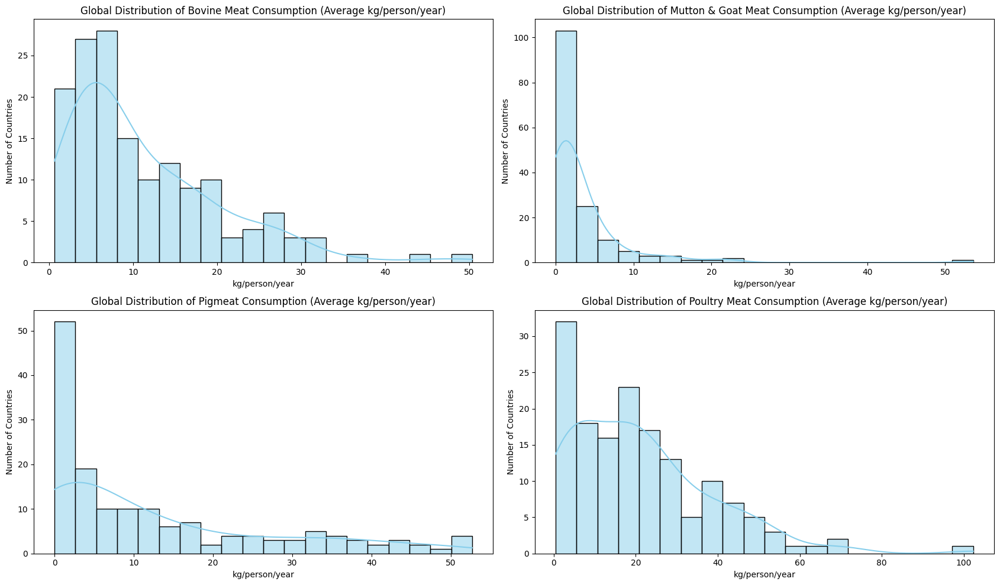
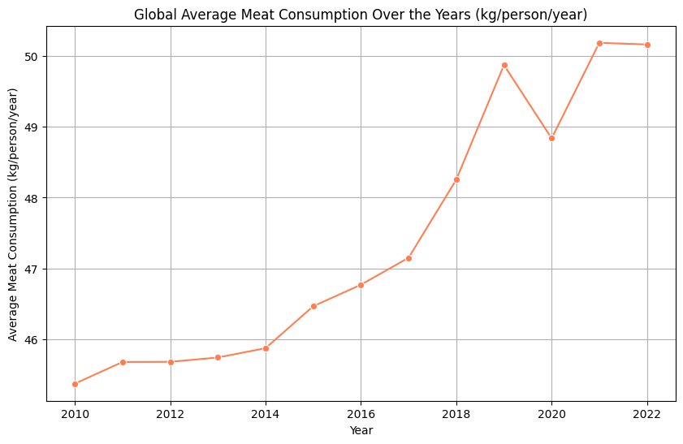
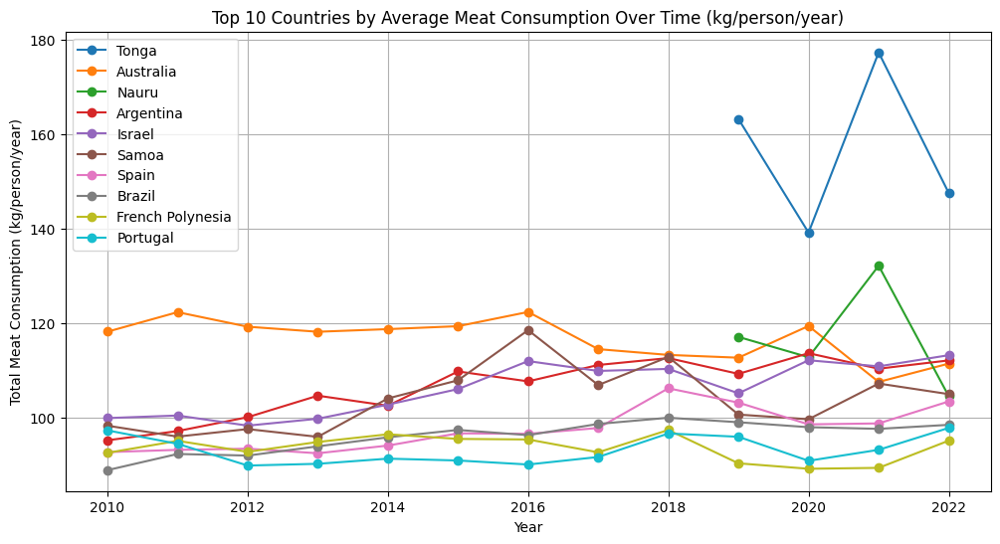

# 🥩 Global Meat Consumption Analysis (2010–2022)

---

## 1. Data Quality Assessment and Processing

This report analyzes global per-capita meat consumption patterns between 2010 and 2022 using a harmonized country-level dataset.

All preprocessing steps, including data cleaning, missing-value handling, and variable harmonization, were completed prior to the exploratory analysis.  
Detailed processing decisions are documented in the data processing report.

---

## 2. Exploratory Data Analysis (EDA)

### 2.1 Dominant Meat Types Across Countries

**<strong>Summary</strong>**

Across all consumption groups and time periods considered, poultry meat is the most widely consumed meat type and the dominant contributor to total per-capita meat consumption.  
This pattern holds both for the 2010–2022 average and for the most recent year (2022), and is observed across the majority of countries.

Pigmeat and bovine meat dominate consumption only in a smaller subset of countries, while mutton and goat meat remain marginal in most cases.

---

### 2.2 Countries Consuming the Most of Each Meat Type

**<strong>Summary</strong>**

Across all meat categories, the countries with the highest per-capita consumption lie in the extreme right tail of the global distribution and represent only a small fraction of the total number of countries.

While these top-consuming countries reach very high intake levels, they do not drive the overall global consumption pattern.

In contrast, the majority of countries cluster at low-to-moderate consumption levels for all meat types, particularly below approximately 10 kg/person/year.  
This indicates that global meat consumption patterns are shaped primarily by widespread moderate consumption rather than by a small number of high-consuming outliers.

**<strong>Implication for modeling</strong>**

The strong skewness and heterogeneity observed across meat-specific distributions suggest that modeling approaches may benefit from treating individual meat types separately or applying robust methods to account for heavy right tails.

---

### 2.3 Evolution of Global Per-Capita Meat Consumption (2010–2022)

**<strong>Summary</strong>**

Global average per-capita meat consumption shows a gradual upward trend between 2010 and 2022, with moderate year-to-year variability.

This global metric represents an unweighted average across countries and should be interpreted as a descriptive indicator rather than a population-weighted estimate of global demand.

---

### 2.4 Top 10 Countries by Overall Meat Consumption

**<strong>Summary</strong>**

To identify the highest overall meat consumers, total per-capita meat consumption was computed as the sum of bovine, pigmeat, poultry, and mutton & goat meat consumption and then averaged per country over the 2010–2022 period.

The top ten countries consistently occupy the upper extreme of the global distribution, exhibiting high per-capita intake across multiple years.

**<strong>Outlier and data coverage note</strong>**

Tonga stands out as an extreme outlier, with substantially higher per-capita meat consumption than other high-consuming countries.  
Although retained as a valid observation, Tonga exhibits notable gaps in time coverage during earlier years, limiting direct comparability in temporal analyses.

For visualization clarity, some comparative plots may exclude Tonga or display it separately, while keeping it included in the underlying analysis.

**<strong>Implication for modeling</strong>**

Given the presence of extreme high-consuming countries and incomplete time coverage for some cases, downstream models may benefit from robustness checks, such as evaluating performance with and without extreme outliers or applying transformations to reduce sensitivity to the right tail.

---

## 3. Key Takeaways for Modeling

- Meat consumption distributions are highly skewed and heterogeneous across countries  
- Poultry consumption dominates global per-capita patterns  
- Extreme outliers exist but represent a small subset of observations  
- Modeling strategies should explicitly account for skewness, heterogeneity, and data coverage differences
