# 🌍 Modeling Drivers of Per-Capita Meat Consumption

## Phase 3 — Modeling, Evaluation, and Interpretation

This section presents the full modeling workflow used to predict **per-capita total meat consumption** at the country level.  
All modeling decisions are explicitly motivated by exploratory diagnostics and empirical performance, not by model preference.

---

## 3.1 Modeling Objective

The goal is to model **average per-capita total meat consumption** using country-level socioeconomic indicators.

### Target
- `total_meat`: sum of bovine, pig, poultry, and mutton & goat meat (kg/capita/year)
- Modeled in **log space** to reduce skewness and heteroscedasticity

### Candidate Features
- GDP per capita  
- Urban population share (%)  
- Production (initially considered, later excluded)

All features are averaged at the **country level (2010–2022)** to focus on structural differences rather than year-to-year fluctuations.

---

## 3.2 Feature Diagnostics and Selection

### Correlation Screening

| Feature          | Correlation with total_meat | Interpretation |
|------------------|-----------------------------|----------------|
| GDP per capita   | Moderate positive           | Strong structural signal |
| Urban population | Moderate positive           | Noisy, secondary effect |
| Production       | Weak / near zero            | No meaningful relationship |

### Raw Feature–Target Relationships

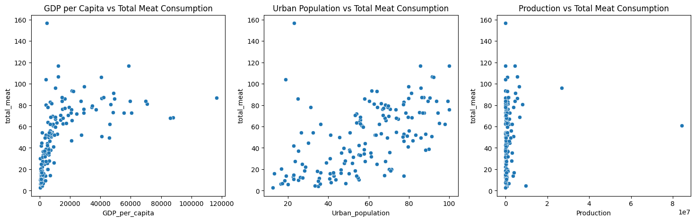

**Key observations**
- **GDP per capita** shows a clear non-linear, saturating relationship
- **Urban population** shows a positive but highly dispersed trend
- **Production** exhibits a degenerate distribution with no interpretable structure

### Decision: Exclude Production

Production is excluded from all subsequent models due to:
- negligible correlation
- extreme scale imbalance
- lack of conceptual alignment with per-capita consumption
- risk of injecting background noise

This decision is data-driven and visually justified.

---

## 3.3 Baseline Linear Models (Raw Scale)

Linear, Ridge, and Lasso regressions are trained using raw-scale features.

### Performance Summary (Raw Target)

| Model  | R² | MSE | MAE | Diagnostic conclusion |
|-------|----|-----|-----|-----------------------|
| Linear | < 0 | High | High | Severe underfitting |
| Ridge  | < 0 | High | High | Regularization ineffective |
| Lasso  | < 0 | High | High | Coefficient collapse |

### Diagnostic Plots

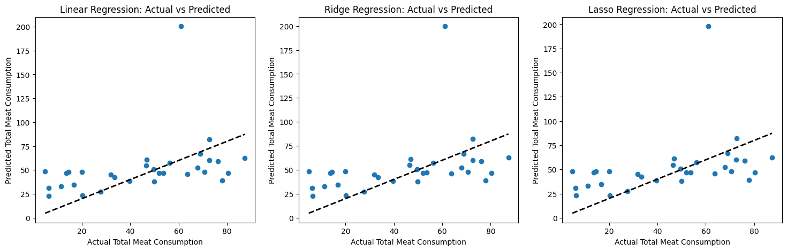

**Conclusion**

All linear models fail catastrophically:
- predictions collapse toward the mean
- systematic underestimation at high consumption
- linear assumptions are violated

These failures are **structural**, not implementation errors.

---

## 3.4 Log-Transformed Feature Space

To better align with linear assumptions, transformations are applied:

- `log_total_meat = log1p(total_meat)`
- `log_GDP_per_capita = log1p(GDP_per_capita)`
- Urban population remains in linear scale

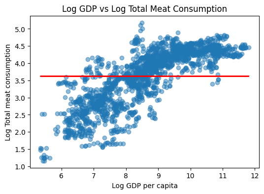

Log transformation:
- reduces skewness
- stabilizes variance
- improves monotonicity

---

## 3.5 Linear Models (Log Target)

Linear, Ridge, and Lasso models are retrained using log-transformed targets.

### Performance Summary (Log Target)

| Model  | R² | MSE | MAE | Stability |
|-------|----|-----|-----|-----------|
| Linear | ~0.63 | ↓ | ↓ | Moderate |
| Ridge  | ~0.63 | ↓ | ↓ | High |
| Lasso  | ~0.59 | ↓ | ↓ | Lower (over-regularization) |

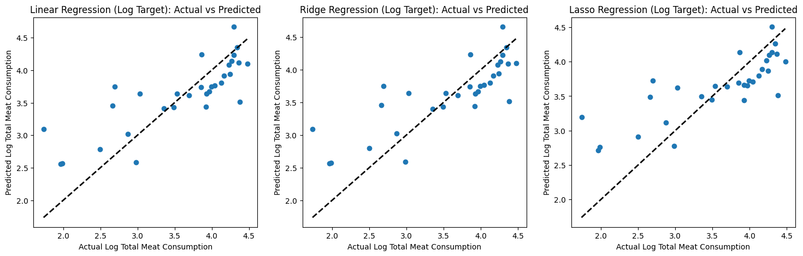

**Interpretation**
- Log transformation significantly improves performance
- Residual structure remains non-random
- Saturation effects are still not captured

---

## 3.6 Polynomial Feature Expansion

Second-order polynomial features are tested to explicitly model curvature.

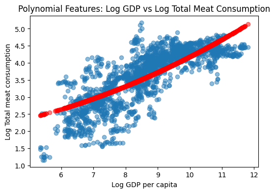
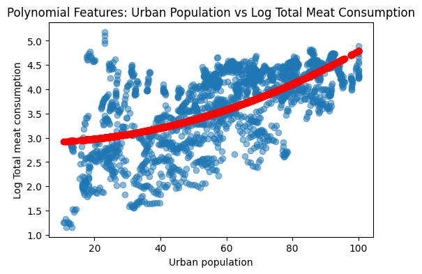

### Performance Comparison

| Model  | R² (log-linear) | R² (polynomial) | ΔR² |
|-------|------------------|-----------------|-----|
| Linear | ~0.63 | ~0.62 | ~0 |
| Ridge  | ~0.63 | ~0.62 | ~0 |
| Lasso  | ~0.59 | ~0.59 | ~0 |

Cross-validation confirms **no systematic improvement**.

**Conclusion**

Polynomial expansion does not meaningfully enhance predictive power.  
The remaining structure is not well captured by global parametric forms.

---

## 3.7 Random Forest Model

A **Random Forest Regressor** is trained using:
- `log_GDP_per_capita`
- `Urban_population`

Target:
- `log_total_meat`

No feature scaling is required.

### Performance

| Metric | Value |
|------|------|
| R² | ~0.71 |
| MSE | Lowest |
| MAE | Lowest |

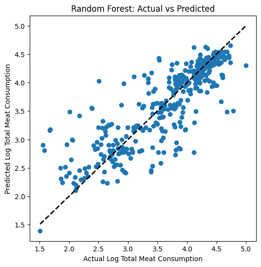

### Single-Feature Random Forest Diagnostics

Random Forest models trained on individual predictors confirm:

- GDP alone captures the dominant saturation structure
- Urban population alone yields weaker, noisier predictions

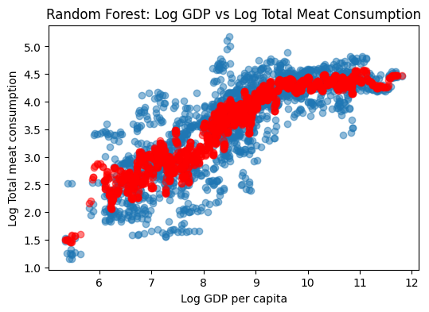
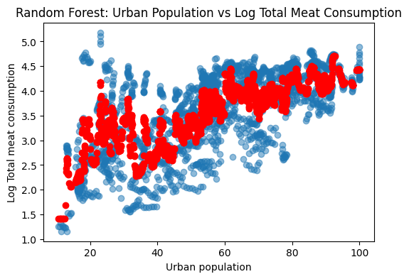

---

## 3.8 Model Diagnostics

### Residual Analysis

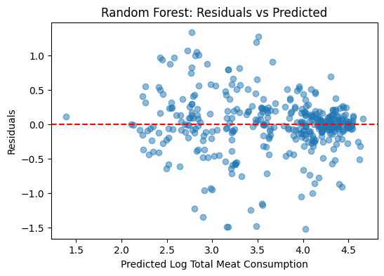

Residuals are:
- centered around zero
- free of strong systematic trends
- mildly heteroscedastic only at extremes

### Robust Error Band

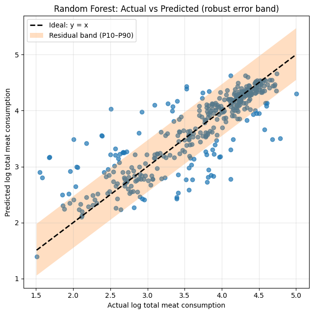

The P10–P90 residual band shows:
- stable predictive uncertainty
- increased dispersion only at extreme values

---

## 3.9 Partial Dependence Analysis

### Individual Effects

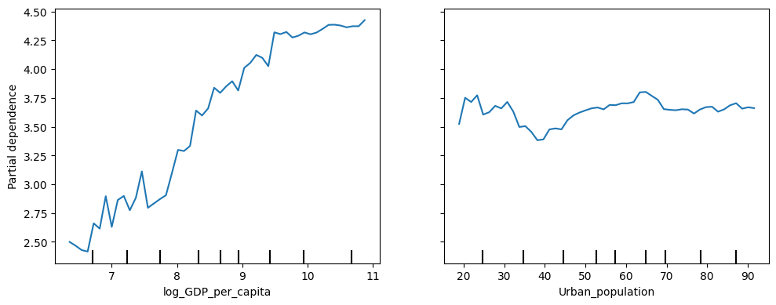

**GDP per capita**
- strong non-linear increase
- rapid growth at low income
- clear saturation at high income

**Urban population**
- weaker effect
- non-monotonic behavior
- diminishing influence at high urbanization

### Joint Effects

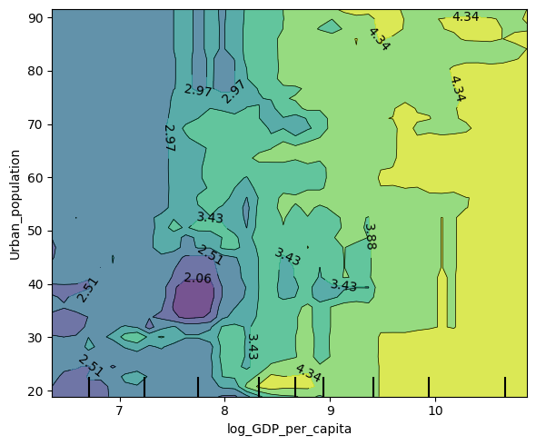

GDP dominates across the full range.  
Urban population acts as a **secondary, conditional modifier**, primarily at intermediate income levels.

---

## 3.10 Feature Importance

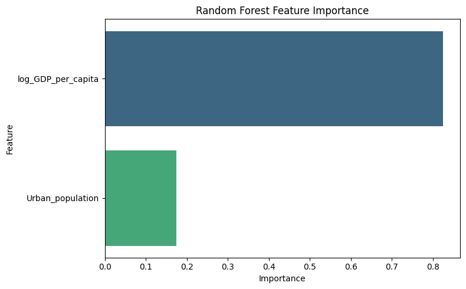

| Feature            | Importance | Role |
|--------------------|------------|------|
| log_GDP_per_capita | Dominant   | Primary driver |
| Urban_population   | Secondary  | Conditional modifier |

Results are consistent with EDA, PDPs, and diagnostics.

---

## 3.11 Global Model Comparison

| Model class | Target space | Best R² | Captures non-linearity | Final status |
|------------|--------------|---------|------------------------|--------------|
| Linear / Ridge | Raw | < 0 | ❌ | Rejected |
| Linear / Ridge | Log | ~0.63 | ⚠️ Partial | Baseline |
| Polynomial | Log | ~0.62 | ⚠️ Limited | Rejected |
| Random Forest | Log | ~0.71 | ✅ Yes | **Final model** |

---

## 3.12 Modeling Summary

- Raw linear models fail due to non-linearity and saturation
- Log transformation improves performance but does not eliminate bias
- Polynomial expansion yields no systematic gains
- Random Forest captures non-linearities and interactions effectively
- GDP per capita is the primary driver of meat consumption
- Urban population plays a secondary, context-dependent role
- Production is empirically irrelevant and excluded

---

## 3.13 Limitations and Outlook

- Country-level averages mask within-country inequality
- No causal interpretation is claimed
- Future extensions may include:
  - education levels
  - food prices
  - dietary composition
  - population-weighted targets

The model should be interpreted as a **descriptive and predictive tool**, not a causal estimator.
